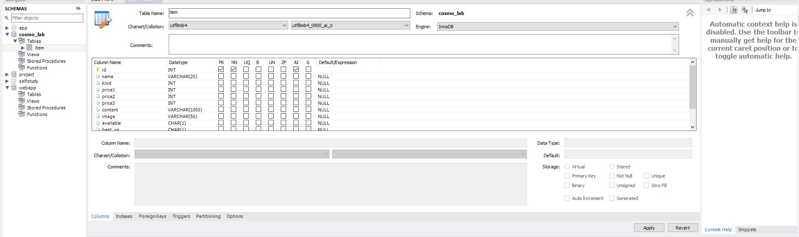

# 12월 23일 day1

# 데이터 베이스

> 일정한 체계속에 저장된 데이터의 집합

| 학번 | 나이 | 이름 |
| ---- | ---- | ---- |
| 0000 | 00   | 000  |
| 0000 | 00   | 000  |
| 0000 | 00   | 000  |

---

DATA는 데이터 베이스 안에서 TABLE 형태로 저장되어짐

* Table : 표 형식으로 저장된 데이터 집합
* row : 학번, 나이, 이름과 같이 객체를 나타내는 
* column (열) :  객체의 속성을 나타내는 

### DBMS ###

> Data Base Management System
>
> 프로그램 필요
>
> 데이터를 관리

[ 사용자 ---> DBMS ---> DATABASE] 

사용자의 명령에 의해서 구축 (설계된 방식으로)

*ORACLE, MySQL, MariaDB 등 

### 매번 사용법을 배워야 할까? ### 

Stractured Query Language : DBMS에 명령을 내리기위해 사용하는 언어

표준 SQL ( 즉, 공인된 국제표준이 있으나 완벽히 부합하지는 않음)

* DBMS는 표준에 있는 기능을 지원, 표준에 없는 기능이 있더라도 다른표현, 표준에는 없는 기능을 지원

(성능향상과 더 다양한 기능을 제공하기 위해서, 표준을 벗어나기를 택하는 경우가 많음)

SQL을 배울때는, 본인이 사용할 DBMS의 SQL을 바로 공부하는 것이 빠른 길!!!! 

---

# MySQL

>
>
> 가장 처음 MySQL AB라고 하는 스웨덴 회사에서 개발, 그 뒤로 MySQL AB는 2008년, Sun Microsystems라는 회사에 인수
>
>2010년에 Sun Microsystems는 Oracle이라는 회사에 인수
>
> 오픈 소스 소프트웨어로 누구나 자유롭게 사용

## 서버 - 클라이언트 구조 

* client(클라이언트) : 사용자가 server에 접속해서 원하는 데이터베이스 관련 작업을 할 수 있도록, sql을 입력할수 있는 화면 등을 제공
* server(서버) : client로부터 sql문 등을 전달받아 데이터베이스 관련 작업을 처리하는 프로그램 

데이터베이스는 DBMS와 분리된 것이 아니라, server가 직접 저장하고 관리하는 데이터 집합체!!!! 

[ 백엔드 개발자 또는 DB관리자는 성능 저하 없이 효율적으로 작업을 처리하고 있는지 체크 해야함 ]

---

나는 MySQL을 사용하고 배웠기 때문에 

미리 다운로드가 되어있어서 쉽게 강의를 들을 수 있었다! 

현재 TEST용 또는 프로젝트 진행 시, 사용했던 스키마가 보이고 

cosmo_lab에 table인 item을  강의 들으면서 열어 보게 되었다. (강의 시, test용으로 진행) 

현재 id 컬럼을 primary key로 설정되어있게 만들어 주었다. 

primary key로 만들기 위해선, pk 체크박스를 클릭해주고 apply 클릭 

## Primary Key

>
>
>테이블에서 하나의 row를 고유하게 식별 할 수 있도록 해주는 column 
>
>즉, 찾을수 있도록

* 일반적으로 테이블에는 Primary key가 존재하는 것이 바람직! 
* Primary Key로 설정하면 같은 값이 있는 row가 추가되는 것을 DBMS가 자동으로 막아주기 때문에 중복된 row가 생길 위험성이 사라짐
* 2가지 종류가 있음 

### Natural Key ##

실제로, 어떤 개체가 갖고 있는 속성을 나태는 컬럼이 Primary Keyrk 가 됐을 때, 이를 Natural Key라고 함

사람은 주민등록번호로 인물을 식별 > 이런 속성을 나타내는 컬럼이 Primary Key가 되면 Natural Key라고 함! 

##  ##

### Surrogate Key ###

어떤 개체의 실제 속성은 아니지만 Primary Key로 쓰기 위해 추가한 컬럼을 Surrogate Key라고 함 

