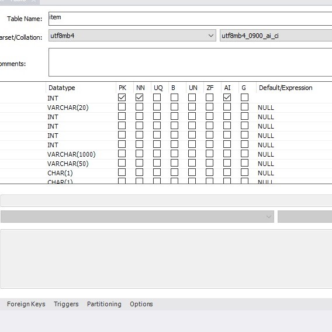
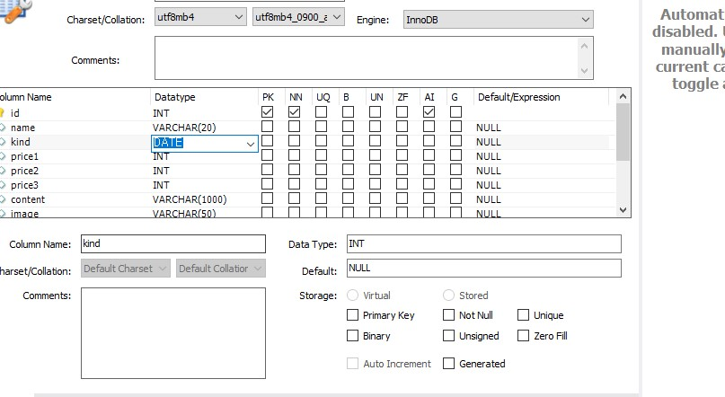
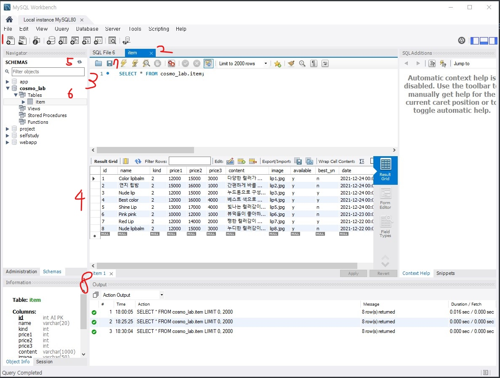

# 12월 24일 day2


어제의 강의 정리를 복습을 한 후,  

오늘 강의를 시작하였당! 


## NOT NULL ##

> 중요한 개념!!! 
>
> NULL이 아니다라는 의미

## NULL ## 

> 값이 존재하지 않는 상태를 나타내며, 
>
> 0, " ", 와는 다른 의미 ( 0도 값이 되고, 빈 문자열도 값이 됨)

즉 NOT NULL (NN)은 반드시 어떤 값이 있어야 함을 의미 

PK를 선택하면 자동으로 NN으로 체크 표시가 되는 이유는 PK는 특정 로우 값을 식별 해야 하는데 NULL은 그 역할을 못함! 


 




* AI (Auto Increment) : 자동 증가라는 뜻으로, 컬럼에 항상 유일한 값이 들어간다는 보장이 있으면, AI 속성을 컬럼에 설정하면 해당 컬럼에 관해서는 DBMS가 자동으로 증가하는 값을 넣어준다는 의미




* DATE : 날짜 관련 컬럼은 DATE 타입으로 저장 할 수 있음
* 창을 누르면 화살표가 생기고 선택할 수 있는 탭이 생김!! 


### Workbench 사용법 ###




현재 프로젝트를 하기 위해 작성한 sql를 가져왔당... ㅎ_ㅎ

처음에 배울 때, 버벅이던게 생각이 나 복습 차원에서!! 


1. SQL문을 쓸수있는 쿼리창!! 새롭게 열 수 있고 그 때 마다 탭의 개수가 늘어남
2. 쿼리창 탭 
3. 쿼리 창 : SQL문을 입력 할 수 있는 공간
4. 조회 결과가 출력되는 영역
5. 새로고침 아이콘 
6. 테이블 조회 아이콘 : 사진 상에 나오지 않았지만 조그만한 아이콘이 있는데, 스패너 모양은 해당 테이블의 컬럼의 데이터 타입을 볼수 있고, 표 모양은 row를 조회할 수 있게 해줌
7. SQL문 실행 아이콘 
8. SQL문을 실행 했을 때, 실행이 잘 되는지 정보를 확인 할 수 있는 영역


---

# 문법 시작

## SELECT 

> 조회할 때 사용하는 구문 

```
SELECT * FROM 테이블명. (컬럼명)
```

*(asterisk) - 각 row의 모든 값을 조회 한다는 의미 

from ~ 로 부터 즉, 어느 데이터로 부터

특정 컬럼 이름을 써도 무방!!! 

----

WHERE은 특정 조건을 설정하기 위해 사용

```
SELECT * FORM 테이블명 WHERE email = 'kkk@kkkk.com'
```

email 컬럼에 있는 kkk@kkkk.com만 조회 할 수 있는 쿼리문임 


---


# 작성 형식 #

1. SQL문에는 항상 세미클론을 써줘야 함! 하나의 종결 단위이기 때문에
2. SQL문안에 공백이나 개행을 자유롭게 넣을 수 있다.
3. SQL문의 대소문자 구분, 기본으로 내장된 키워드(예약어) 대문자로 써주고, 나머지는 소문자 => 가독성을 위해
4. 데이터 베이스 이름과 테이블 이름 > 테이블 이름만 써줘도 무방! 


