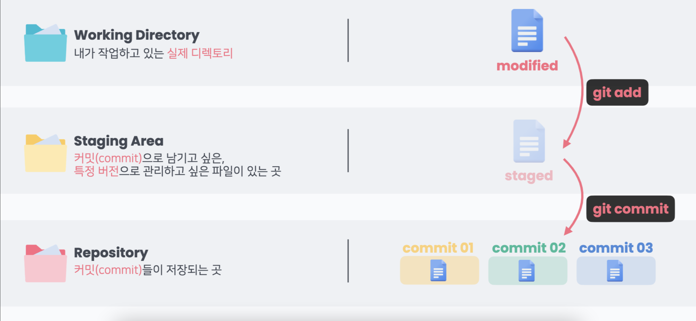

# 9월 17일 특강

---

> ## 복습 
>
> > git 명령어 
> >
> > * git init : Local Repository 생성
> > * git status : 현재 git으로 관리되고 있는 파일들의 상태 확인
> > * git add [ 파일이름 ]  _ 추적되지 않는 파일과 추적하고 있는 파일 중 수정 파일을 올리는 것 ( git add .  모든파일을 올리는 것 )
> > * git log : git의 commit 상태 보기
> > * git diff : 두 commit 간의 차이 보기
> > * git config --global --list : 깃 사용자 정보 확인
> > * git remote rm {local repo} : remote 삭제
> > * git pull : remote에서 local로 코드를 가져옴 
> > * git restore --staged{file} : add한 파일을 취소하는 것
> > * git restore {file} : Working Directory 변경사항 취소하기 ( 가장 최신 commit 상태로 돌리는 것) _ 주의해서 사용 할 것 
> > * git reset --hard(mixed, soft) {c_id} : commit을 돌림,  hard 옵션은 Working Directory, Staging Area, repo을 모두 해당 commit으로 되돌림, mixed는 Staging Area, repp만 해당 commit으로, soft는 repo만 해당 commit의  상태로 되돌림)
> > * git ignore : 원하지 않는 파일 제외하기

---

## Remote Repository 연결

- git remote add origin {remote_repo} : local과 remote_repo 연결
- git push -u origin master (origin - remote, master - local) : remote_repo와 branch 연결
- git clone {remote_repo} : remote repo를 local로 복사 (git clone https://github.com/miteum/pull_test.git . 하면 바로 리포지스토리)

---

---

# 브랜치 ( Branch) 

> 특정 커밋을 가리키는 포인터

## 

1. 브랜치 생성 : git branch {branch name}
2. 브랜치 이동 : git checkout {branch name}
3. 브랜치 생성 및 이동 : git checkout -b {branch name}
4. 브랜치 목록 : git branch
5. 브랜치 삭제 : git branch -d {branch name}

---

# (Branch) merge : 

> 각 branch에서 작업을 한 후 이력을 합치기 위한 명령어

1. fast forward merge : 기존 master에 변경사항이 없어 단순히 앞으로 이동
2. merge commit case : master에 변경사항이 생겼을 경우 master를 commit한 후에 브랜치와 merge해야 됨
3. collaboration with PR : pull request -> new pull request -> master 확인 후 merge

Git Flow : Git을 활용하여 협업하는 흐름으로 branch를 활용하는 전략을 의미하고 Github Flow, Gitlab Flow도 있음

---

 1. Shared Reposiroty Model : 

    ​                                   해당 프로젝트 저장소에 직접적인 Push 권한 있음

 2. Fork and Pull Model : 

    ​                                  해당 프로젝트 저장소에 직접적인 Push 권한 없음

    

    - remote repo 생성
    - Fork

    - loacl repo로 clone
    - branch 생성해서 작업 후 push
    - base repo master에게 PR

---

사진출처 : HPHK GIT/GITHUB 특강 자료
